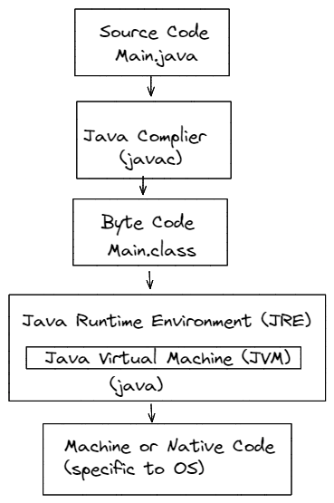

# Java - The Complete Guide <!-- omit in toc -->

![![java-logo])](assets/java-logo.svg)
- [1. Setup and First Program](#1-setup-and-first-program)
  - [1.1. Installation](#11-installation)
  - [1.2. An Intro to Language](#12-an-intro-to-language)
  - [1.3. How it works under the hood?](#13-how-it-works-under-the-hood)
  - [1.4. Java Editions](#14-java-editions)
- [2. Type System](#2-type-system)
  - [Primitive Types](#primitive-types)

---

## 1. Setup and First Program

### 1.1. Installation  

Install JDK

**J**ava™ Platform, Standard Edition (SE) **D**evelopment **K**it (JDK™).  
The JDK is a development environment for building applications and components using the Java programming language.

The JDK includes tools (compiler, reusable libs) useful for developing and testing programs written in the Java programming language and running on the Java platform.  

### 1.2. An Intro to Language

**Function** is a reusable piece of code (or set of instructions) which carries out a specific task.

**Class** is a container of related functions.

Every Java program should at least consist of one Class and a Function namely `main()`. It's a entry point for the program.

When function belong to a `class`, then it is called a method. So, `main()` is a method

Basic structure - bare minimum  

```java
public class Test {
  public static void main(String[] args){
    // write your code here
  }
}
```

- class - **P**ascal**N**aming**C**onvention  
- method - **c**amel**N**aming**C**onvention  
- public is access modifier
- void  means return nothing  
- static -
- args - parameter
- Observe the opening bracket is right aligned for class and method.

First program,

Create a **Test.java** file with below content,

```java
public class Test {
  public static void main(String[] args){
    System.out.println("Hello World");
  }
}
// Hello World
```

### 1.3. How it works under the hood?



1. Compiling source code to Bytecode using **javac** - the compiler. ***.java to *.class**. Bytecode is OS independent.

   ```console
   C:\personal\java>javac Test.java
   ```

2. Converting Bytecode to machine level instructions. Here, **java** is an exe or a component to invoke the JVM. JVM is one of the components of JRE.

   ```console
   C:\personal\java>java Test
   Hello World
   ```

3. This will output the text *Hello World* on console.
4. When we use IDE like IntelliJ or Eclipse, running the project will take care of all above steps in a single click.

Let's install IntelliJ IDEA IDE and create the first program,

```java
package com.avinash;

public class Main {

    public static void main(String[] args) {
        System.out.println("Hello World");
    }
}
// Hello World
```

- package is container or logical grouping of classes

### 1.4. Java Editions

1. Standard Edition (SE) - Core Java
2. Enterprise Edition (EE) - Core Java + Additional libraries to support enterprise need
3. Micro Edition (ME) - Core Java + Mobile specific libraries
4. Java Card - To program smart cards

The current version is Java SE 17

## 2. Type System

**Variables** are used used store the data in computer memory.  
They are also called, names, field, label or **Identifiers**, because they uniquely identify the variables.  

The Java programming language is statically-typed, which means that all variables must first be declared before they can be used. This involves stating the variable's type and name.

Ex,  

```java
int students_count = 1000;
```

Doing so tells your program that a field named "students_count" exists, holds numerical data, and has an initial value of 1000.  
When we run above code, java will allocate the some memory and stores the value 1000 in that memory space. student_count is like a label of that memory location  and referenced by the address of that memory. In future, we can access this value by using the name or label like below.

```java
System.out.println(students_count);
```

Next obvious question is , what type of data can be stored by computer memory or a variable can hold?

### Primitive Types

3- Primitive Types - coursedownloader.net
https://docs.oracle.com/javase/tutorial/java/nutsandbolts/datatypes.html